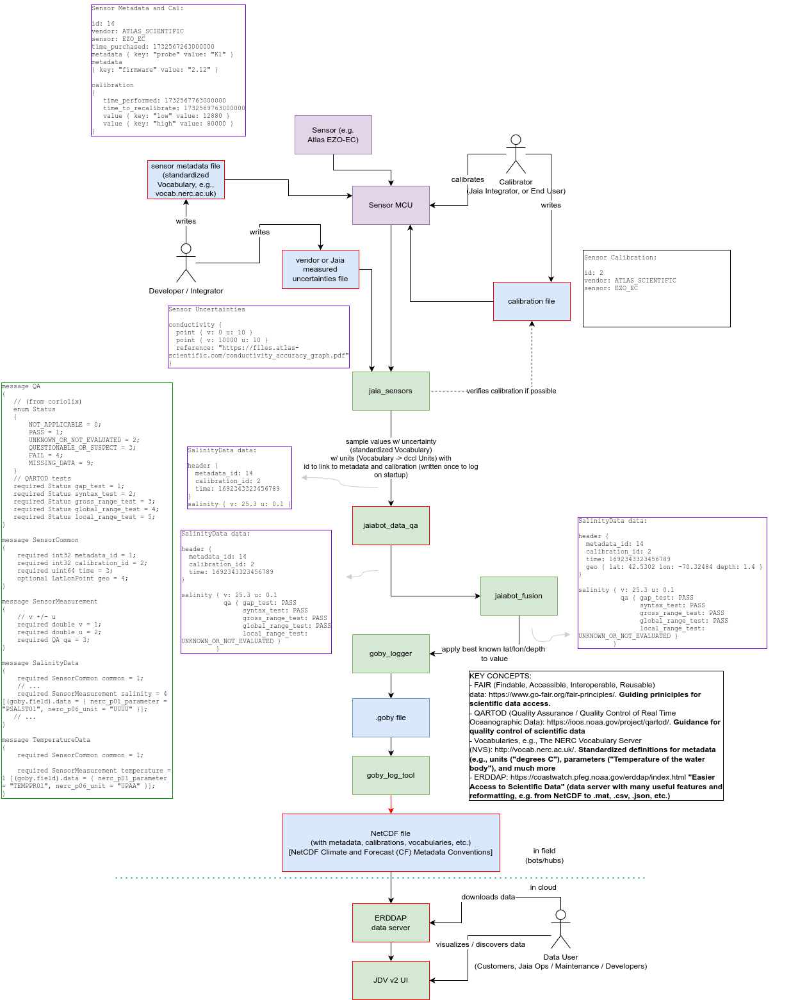

# Sensors and Data Processing

Starting with the BIO variant, JaiaBots will use a unified sensor board (with a microcontroller for low level I/O, the "sensor MCU"), and the main computer (Raspberry Pi) will auto discover the bot type and sensor suite by querying the sensor MCU.

The application `jaiabot_sensors` is responsible for communicating with the sensor MCU, and handling the data processing pipeline from here.

## Philosophy

### Architecture

Implementing this pipeline is a work in progress, but the overall vision for the architecture is in the following figure:

### MCU/jaiabot_sensors division

The MCU should do the minimum amount of processing required to provide raw data to the `jaiabot_sensors` application. Any empirical calculations (e.g. conductivity to salinity, CTP to sound speed, etc.) should be done in the `jaiabot_sensors` driver. This is intended to keep the MCU code as simple as possible and high performance.

All data processing, metadata tagging, applying calibration, QA/QC is done in `jaiabot_sensors`.

## Communication with MCU

The MCU/Raspberry Pi communications is performed over a serial connection using the Consistent Overhead Byte Stuffing (COBS) protocol for packetization. Each COBS message is composed of an encoded Protobuf message followed by a CRC32 for error detection:

- transport: serial
	+ packetization: COBS
		* message: [Protobuf (N-bytes)][CRC32 (4-bytes)]

For messages to the MCU, the `jaiabot::sensor::protobuf::SensorRequest` Protobuf message is always used, and for message from the MCU, the `jaiabot::sensor::protobuf::SensorData` message is always used. Both are defined in `jaiabot/src/messages/sensor/sensor_core.proto`.

Both messages are compiled for C++ (libjaiabot_messages.so) and for C (libjaiabot_messages_c.so) using NanoPB. They are designed using NanoPB to be a fixed size for static memory allocation. This is checked at compile time by the unit test in `jaiabot/src/test/sensor/nanopb/test.c`.

### Comms Sequence 

The MCU is not expected to do anything until it receives a SensorRequest message from the `jaia_sensors` application. Once this message is received, it responds with the metadata for each sensor connected (one message per sensor). `jaiabot_sensors` uses this metadata message to launch the correct sensor driver threads. 

Once each thread launches, it sends a SensorRequest message with the `cfg` (configuration) field populated. This includes any required configuration for the MCU for that sensor. At a minimum this is the desired sample rate, but can include arbitrary strings as required.

Once the `SensorRequest.cfg` is received, the MCU is expected to stream the desired data at the requested frequency without any further messages from the `jaiabot_sensors` application. If any commands are required for a particular sensor (e.g., stop sampling, update configuration, etc.), these will be included in `SensorRequest`.

This figure shows an example of starting an EC and pH driver:

