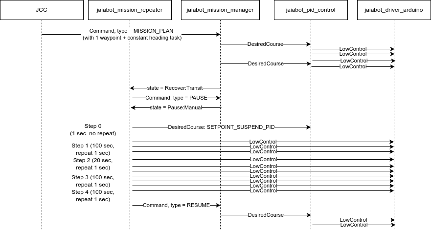

# Mission Repeater

The `jaiabot_mission_repeater` is a testing tool designed to enable repeatable data collection runs. It was initially developed to perform low level testing of rudder performance using scripted LowControl commands.

It can easily be extended to script other publications by extending the `oneof publication` in `MissionRepeater.Script.Step` (in `jaiabot/src/bin/mission_repeater/config.proto`) and updating the `run_step()` method in `mission_repeater.cpp`.

## Mission design

The `jaiabot_mission_repeater` is designed to be run in addition to all the normal applications. It will put the `jaiabot_mission_manager` in the Paused::Manual state when executing the script. Any commands sent from the hub (for example, STOP) that change the mission will stop the script execution, ensuring the vehicle is always within operator control.

The `jaiabot_mission_manager` waits for the mission to reach **Recovery::Transit** and then immediately sends a PAUSE command to `jaiabot_mission_manager`. Once the **Pause::Manual** state is reached, the `jaiabot_mission_repeater` runs through the publications defined in the configuration under `script`. At the end of these steps, it resumes the mission (that is, **Recovery**).

This means any mission can be used to run with `jaiabot_mission_repeater` before the script, and at the end the vehicle recovers normally.

## Running

`jaiabot_mission_repeater` is not run normally on the bot. To use it, it must be run manually, preferably using `screen` so that the loss of wifi connectivity does not hang the process:

```
screen
/usr/bin/jaiabot_mission_repeater -C '/usr/share/jaiabot/config/gen/bot.py jaiabot_mission_repeater'
# leave running or CTRL-A, D to detach
```

### Publications

The `jaiabot_mission_repeater` publishes the values in the script (`oneof publication`) as well as the start and end of each script step to `groups::script_step_start` and `groups::script_step_end`, respectively. This is useful for log analysis so you can know when each step of the script begins and ends.

## Configuration

The main configuration for `jaiabot_mission_repeater` is the `script` field:

```
script {
  step { # repeated - forms the script
    duration: # in seconds, how long to run the step for before starting the next step
    step_marker:  # integer marker for log file analysis - should be unique
    repeat_interval:  # if set, repeat the publication waiting this number of seconds between publishes. if not set, the step is only published once
    
    # oneof publication
    desired_setpoints { # see high_control.proto } # OR
    low_control { # see low_control.proto }
    }
  }
}
```


## Example

For running rudder tests, we want to do several things:

 - Send a mission with at least one waypoint and a constant heading task (using JCC)
 - Configure `jaiabot_mission_repeater` to stop the PID then run a set of constant motor/rudder commands (using `jaiabot/config/templates/bot/jaiabot_mission_repeater.pb.cfg.in`).
 
 Sequence diagram for this mission:
 
 
Example script (for `jaiabot/config/templates/bot/jaiabot_mission_repeater.pb.cfg.in`):

```
script {
    # shut off the PID controller
    step {
        duration: 1 # sec
        step_marker: 0
        desired_setpoints {
            type: SETPOINT_SUSPEND_PID
        }
    }

    # straight leg
    step { 
        duration: 100 # sec
        step_marker: 1
        repeat_interval: 1 # sec
        low_control { 
            id: 0
            vehicle: $bot_id
            time: 0
            control_surfaces { 
                motor: 40
                port_elevator: 0
                stbd_elevator: 0
                rudder: 0
                timeout: 5
                led_switch_on: false
            }
        }
    }

    # turn
    step { 
        duration: 20 # sec
        step_marker: 2
        repeat_interval: 1 # sec
        low_control { 
            id: 0
            vehicle: $bot_id
            time: 0
            control_surfaces { 
                motor: 20
                port_elevator: 0
                stbd_elevator: 0
                rudder: -15
                timeout: 5
                led_switch_on: false
            }
        }
    }

    # straight leg
    step { 
        duration: 100 # sec
        step_marker: 3
        repeat_interval: 1 # sec
        low_control { 
            id: 0
            vehicle: $bot_id
            time: 0
            control_surfaces { 
                motor: 40
                port_elevator: 0
                stbd_elevator: 0
                rudder: 0
                timeout: 5
                led_switch_on: false
            }
        }
    }

    # tight turn
    step { 
        duration: 100 # sec
        step_marker: 4
        repeat_interval: 1 # sec
        low_control { 
            id: 0
            vehicle: $bot_id
            time: 0
            control_surfaces { 
                motor: 20
                port_elevator: 0
                stbd_elevator: 0
                rudder: -30
                timeout: 5
                led_switch_on: false
            }
        }
    }    
}
```

